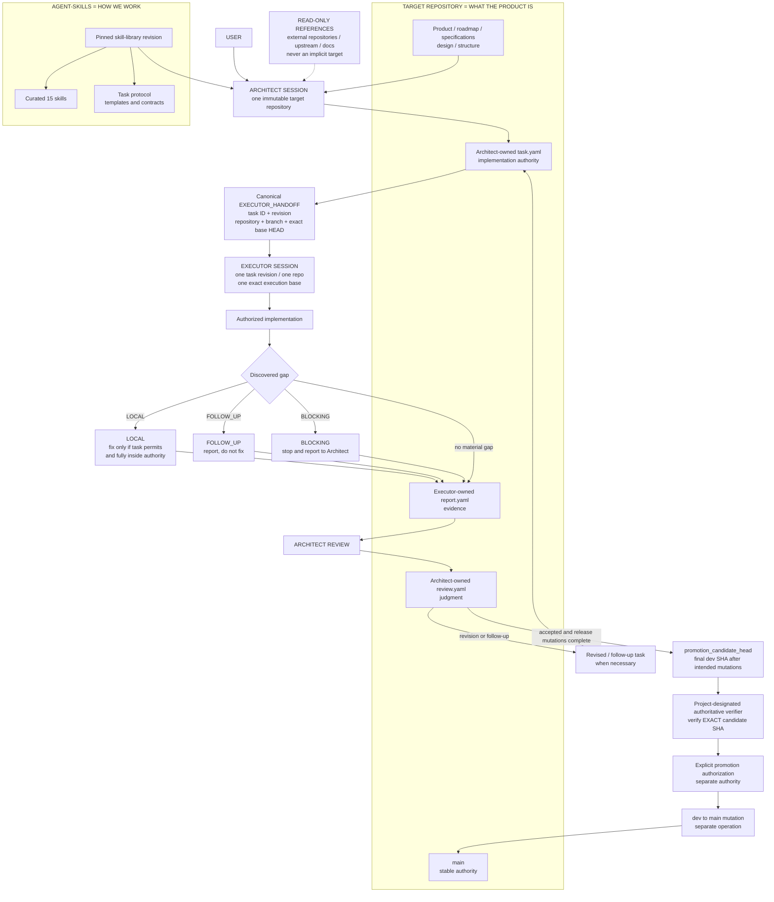

# agent-skills

A deliberately curated library of **exactly 15** reusable agent skills plus deterministic contracts, templates, and protocols for software engineering across repositories.

`agent-skills` defines **HOW WE WORK**. A target repository defines **WHAT THAT PRODUCT IS**: product intent, roadmap, specifications, design, structure, source code, deployment policy, and project-specific verification authority. Live project tasks belong to the target repository; reusable methods and protocol shapes belong here.

## Overall system

<!-- SYSTEM_DIAGRAM_START -->

<!-- SYSTEM_DIAGRAM_END -->

The active protocol is deliberately manual-capable: canonical handoffs can be copied between sessions, and no coordinator, service, database, queue, registry, shared runner/tunnel, or automatic cross-chat messaging is required. Supported protocol version is **3**. Unsupported versions fail closed and are never silently upgraded.

Four Git identities are deliberately distinct and must never be treated as interchangeable:

1. **Task snapshot / handoff `base_head`**: the exact pre-execution repository state captured after final planning/task mutation; Executor reads the pinned task from this exact commit.
2. **Report `final_execution_head`**: the implementation HEAD before the Executor-owned report artifact is committed.
3. **`reviewed_report.commit`**: the exact commit containing the report that Architect actually reviewed.
4. **`promotion_candidate_head`**: the final `dev` SHA after all repository mutations intended for promotion are complete.

## Core session invariants

An Architect session binds once to exactly one immutable target repository. It may inspect external repositories, upstream source, dependencies, or documentation only as read-only references. Asking the bound session to govern a second execution target requires `NEW_ARCHITECT_SESSION_REQUIRED`.

An Executor session binds to exactly one approved task revision, one target repository, one branch, and one authorized exact execution base. It does not switch projects, execute unrelated tasks, reinterpret architecture, or expand scope because neighboring work is visible.

Target-repository authority always wins on project-specific facts. Architect may author project planning/authority artifacts only when explicitly authorized; it does not thereby become the application implementation role. Executor owns only the implementation and evidence authorized by the exact task.

## Curated skill catalog

<!-- SKILL_CATALOG_START -->
| Skill | Type | Decision domain / trigger |
| --- | --- | --- |
| `architect` | core | repository-bound routing/governance, planning authority, skill selection, tasks, handoffs, report review |
| `executor` | core | controlled execution of one approved task revision against one exact repository/base |
| `research` | reasoning | unknown/current/disputed/version-sensitive facts that materially affect an engineering decision |
| `reuse-first` | reasoning | build-vs-reuse decisions involving repository capabilities, standards, platforms, libraries, or upstream implementations |
| `simplicity` | reasoning | proposed abstractions, services, layers, state, configuration, dependencies, automation, or speculative generality |
| `design-review` | review | proposed or implemented consequential architecture, interfaces, structural integrity, and product-direction alignment |
| `gap-analysis` | review | missing requirements, states, failure paths, ownership, migration, verification, or unspecified decisions |
| `adversarial-audit` | review | stale state, retries, concurrency, partial failure, process death, dependency faults, and governance rationalizations |
| `security-review` | specialist | authentication, authorization, secrets, sensitive data, trust boundaries, untrusted input, and security-critical integrations |
| `verification` | engineering | testing/evidence strategy, regression proof, contract/invariant testing, acceptance evidence, confidence before completion |
| `debugging` | engineering | reproducible root-cause analysis for bugs, failing tests, CI failures, regressions, and unexpected behavior |
| `reliability` | engineering | operability through load/failure/retry/recovery, rollout/rollback, observability, and production incidents |
| `optimization` | engineering | measured performance, resource, developer-loop, automation, or cost constraints |
| `github-dev-main-workflow` | workflow | Git/GitHub governance under `dev` integration + `main` stable, including promotion and Actions risk |
| `cloud-run-basics` | domain | Google Cloud Run deployment, configuration, security, scaling, troubleshooting, and platform-specific cost behavior |
<!-- SKILL_CATALOG_END -->

The validator treats this exact set as the curated taxonomy. Removing one skill and substituting an unrelated skill while keeping the count at 15 must fail validation. There is no 16th structure, product-planning, documentation, coordinator, or task-management skill hidden behind a different label.

## Skill selection and pinning

Architect uses progressive disclosure:

`task → target authority → names/descriptions → shortlist → candidate bodies → remove overlap → planning provenance + execution skill set`

Normally activate **2–5 skills**. More than about seven is a decomposition/review signal. Never preload all 15 bodies.

Planning and execution skills are separate:

- `architect_analysis_skills` record methods used to research/design/specify the task;
- required `execution_skills` must be resolved by Executor;
- recommended execution skills are non-blocking and cannot expand scope.

Tasks pin the shared library once:

```yaml
skill_library:
  repository: phatnguyen03022001/agent-skills
  revision: "<exact immutable commit SHA>"
```

External skills must carry their own immutable source/revision. Executor must not silently use a newer ruleset, a newer task revision, or latest branch state in place of what the canonical handoff pins.

## Task artifacts and authority

Live tasks are project state and belong in each target repository:

```text
.agent/tasks/
  TASK-0001/
    task.yaml
    report.yaml
    review.yaml
```

At current scale, that directory is the task list. Do not add task databases, registries, search services, or generated indexes without observed scale evidence. The canonical `handoff.yaml` shape is an external execution locator/authorization and does not need to be committed beside the live task artifacts.

Reusable shapes in this repository:

- [templates/task.yaml](templates/task.yaml): Architect-owned implementation authority;
- [templates/handoff.yaml](templates/handoff.yaml): small Architect-to-Executor authorization/locator containing task identity and exact repository/base;
- [templates/report.yaml](templates/report.yaml): Executor-owned evidence;
- [templates/review.yaml](templates/review.yaml): Architect-owned judgment;
- [contracts/IMPLEMENTATION_CONTRACT.md](contracts/IMPLEMENTATION_CONTRACT.md): task semantics;
- [contracts/IMPLEMENTATION_REPORT.md](contracts/IMPLEMENTATION_REPORT.md): report semantics;
- [contracts/ARCHITECT_REVIEW.md](contracts/ARCHITECT_REVIEW.md): review semantics.

Authority boundaries are explicit: `task.yaml` defines implementation authority; the handoff locates and authorizes that exact task snapshot; `report.yaml` records evidence; `review.yaml` records Architect judgment; the project-designated verifier owns authoritative PASS/FAIL; promotion authorization is separate; mutating `main` is a separate operation. One role must not silently rewrite another role's artifact or manufacture another role's authority.

A committed `task.yaml` does **not** write the SHA of the commit containing itself. Architect commits final planning/task state, refreshes the target branch, captures exact HEAD `H`, then emits the canonical handoff with `base_head=H`. Executor verifies live HEAD equals `H` and reads `task.path` from `H`; scope, skills, structure policy, authority sources, and acceptance criteria remain authoritative in that exact task rather than being duplicated into the handoff.

Likewise, `report.yaml.final_execution_head` is the last implementation HEAD before any report commit, while `reviewed_report.commit` identifies the later commit containing the exact report Architect reviewed. Neither value is automatically the promotion candidate.

## Gap policy

Executor classifies every material discovered gap as exactly one of:

- `LOCAL`: necessary for current acceptance criteria and completely inside approved authority; Executor may fix it only when task policy explicitly permits `local_auto_fix` and no architecture/spec/public-contract/dependency/structure boundary is crossed;
- `FOLLOW_UP`: real but unnecessary for the current task or outside current authorization; record evidence and do not fix it;
- `BLOCKING`: safe/correct continuation requires missing or conflicting Architect authority; stop and return evidence for Architect action.

Discovery is never authorization. Follow-up tasks preserve originating `task_id` and `gap_id`; a follow-up does not silently modify the pinned task that produced it.

## Scope and structure governance

Noise control is protocol, not an optional skill. Task approval never implies unrelated cleanup, adjacent fixes, speculative features, undocumented scope expansion, architecture/roadmap/canonical-spec/public-contract drift, unauthorized dependency changes, structural reorganization, or “while I'm here” refactors.

Target-project conventions own physical structure. There is no universal Go, Python, TypeScript, or other folder layout imposed by this repository. Architect classifies `structure_authority` as exactly one of:

- `RESOLVED`: a canonical project source is required;
- `NOT_APPLICABLE`: a rationale is required and the task cannot materially affect repository/module/file structure;
- `UNRESOLVED`: execution is not ready.

Executor cannot change that status to unblock itself. A README typo may legitimately be `NOT_APPLICABLE`; adding source files, moving modules, changing dependency boundaries, or reorganizing structure may not.

Every new source file must have semantic ownership in an existing or explicitly authorized feature/domain/component/layer/infrastructure responsibility. Generic `utils`, `helpers`, `common`, `misc`, or `shared` dumping grounds require genuine cross-domain ownership and project-authority justification. No orphan source files are allowed.

Do not add layers, factories, registries, plugin systems, extension points, services, queues, caches, shared modules, top-level directories, or scaling infrastructure for hypothetical future needs. Small implementation-local decomposition is allowed only when the task explicitly grants bounded count, location, and purpose for unlisted files.

Prefer:

`existing solution → localized change → small local abstraction → larger abstraction → subsystem`

## Exact-SHA verification and promotion

For repositories adopting the shared two-branch model:

- `dev` = integration and normal mutation;
- `main` = stable authority;
- delegated/normal implementation defaults to `dev`;
- direct implementation on `main` is forbidden by default;
- force push, history rewrite, and unnecessary branch/PR ritual are not part of the normal flow.

Promotion uses the distinct identities defined above:

```text
planning/task commit
→ handoff base_head
→ implementation commit(s)
→ report final_execution_head
→ report commit
→ Architect review
→ review commit if required
→ finish every intended dev mutation
→ refresh dev
→ promotion_candidate_head
→ project-designated authoritative verification of EXACT candidate SHA
→ no further dev mutation
→ separate explicit promotion authorization
→ separate dev -> main mutation of the verified candidate
```

Before promotion, the candidate must still be current `dev` HEAD, satisfy the project's ancestry/divergence policy against intended `main`, and have required authoritative verification that explicitly identifies that exact SHA. If `dev` changes after candidate verification, prior verification/authorization is stale: `REVERIFY / REVIEW_REQUIRED`.

Architect `ACCEPTED`, CI green, project-verifier PASS, promotion authorization, and actual `main` mutation are separate signals. No successful push, review, CI run, or “latest task” causes automatic promotion.

Branch protection is separate platform enforcement and remains deferred from this protocol pass. Written protocol governs procedure; GitHub branch protection/rulesets are an independent repository setting.

## Validation and GitHub Actions

The local hierarchy-aware validator enforces the curated set, unique folder/name identity, lowercase/hyphen naming, Agent Skills `name <= 64`, `Use when` descriptions, description length, internal Markdown links, README catalog sync, supported protocol version, and structure-aware paths/types for the canonical task/handoff/report/review templates.

Its YAML validation is intentionally constrained and stdlib-only. It rejects duplicate mapping keys and invalid indentation for this protocol subset; it is not a general YAML implementation. Core/frequently loaded skills should stay concise; heavy reference material belongs outside `SKILL.md` rather than in god skills.

The repository keeps one bounded `dev` validation workflow:

- relevant `push` to `dev` only;
- one standard Linux job;
- read-only contents permission;
- no matrix, PR duplicate, schedule, artifacts, cache, external paid service, or automatic rerun;
- concurrency cancellation and a short timeout;
- `actions/checkout` pinned to an immutable full commit SHA.

This private repository consumes the owner's included GitHub Actions quota for standard hosted runners when available and can become billable after that quota is exhausted. A short run is not proof of `$0`.

The complete reusable semantics are in [protocols/TASK_PROTOCOL.md](protocols/TASK_PROTOCOL.md).

## Deliberately absent

No coordinator, shared runner/tunnel, task database, automatic Architect-to-Executor messaging, automatic main promotion, paid/larger CI infrastructure, feature skill, noise-control skill, file-naming skill, or task-management skill is added here. Branch-protection enforcement and shared runner/tunnel infrastructure remain separate deferred decisions. These omissions are intentional boundaries, not missing pieces to fill speculatively.
